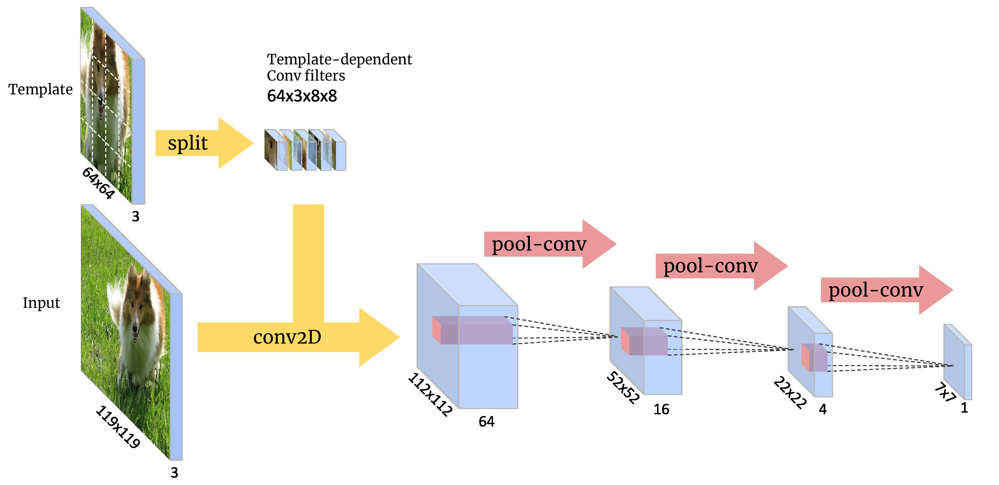

# PyTorch-PatchNet

## Overview

This repo contains PatchNet model description in PyTorch and its training/evaluation with SiameseFC. It heavily relies on [siamfc-pytorch]([https://github.com/huanglianghua/siamfc-pytorch](https://github.com/huanglianghua/siamfc-pytorch)).


## Content

- [Performance](#Performance)
- [Prerequisite](#Prerequisite)
- [How to use](#How-to-use)
- [Pretrained Models](#pretrained-models)
- [Testing Pretrained Models](#testing-pretrained-models)


## Performance

<p align="center">

</p>

To describe the animation above, left side window shows the performance of PatchNet when we are skipping every other 4 frames; Middle window shows the performance of PatchNet and SiameseFC combined model; Where the right side window shows the original performance of SiameseFC. All three profiling are tested with PyTorch-1.4 on Jetson Nano with a quad-core ARM Cortex-A57 CPU and 128-core Maxwell GPU.

<p align="center">

</p>

Inference latency on Jetson Nano. All models are tested with task-dependent data resolution and batch size of 1. Due to its simplicity, PatchNet does not achieve high hardware utilization, but it is still orders of magnitude faster than other models.

## Prerequisite

* Python 3
* PyTorch>1.2
* GOT-10k dataset (for training)

## How to use


**Demo** 
```
python3 scripts/demo_skipframe.py
```

**Evaluate on OTB2015 dataset**
```
python3 scripts/test_<name>.py
```

**Train PatchNet model**
```
python3 scripts/train_patchnet.py --dataset <got_10k_root> --save pretrained/<my_fancy_model>
```

## Pretrained Models

Here we provide the pretrained model of PatchNet and SiameseFC.

### PatchNet

```
URL 
```

### Siamfc

```
URL 
```

## Testing Pretrained Models

For example, to test the downloaded pretrained models on SiameseFC, one can run

```
placeholder for sample running command
```

